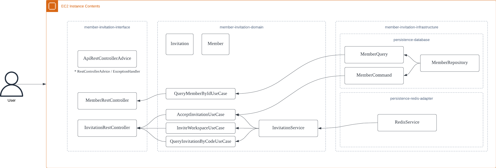

# member-invitation-java-springboot

## Context

### ACs - Biz

- 그룹 매니저는 그룹에 참여자를 초대할 수 있습니다.
- 사용자는 그룹 참여 초대 링크를 통해 그룹에 참여할 수 있습니다.
- 초대 링크는 1회 사용 시 만료됩니다.

### ACs - Tech

- 회원 초대 시 DB에 임시 회원을 생성하고 초대 링크를 발행합니다.
    - 생성 시에 회원의 이름, 전화번호, 이메일은 필수 값입니다.
- 초대 링크 수락 시 임시 회원을 활성화하고 초대 링크를 만료합니다.
- 회원의 인증/인가는 구현하지 않습니다.

## Challenge

### 휘발성 성격을 지닌 초대 링크를 어떻게 효율적으로 관리할 것인지?

- 초대 링크 그 자체로는 영속성을 지닌 데이터가 아니라고 판단
    1. 초대 링크 수락 시 링크 만료
    2. 영구적으로 저장해두어 Business Metric으로 삼을만한 포인트도 존재하지 않음 -> 필요 시 로그로도 충분히 파악 가능
    3. 추후 초대 링크 유효 기간 등 적용 고려
- 초대 링크 저장소로 Redis 채택
    1. 주기억장치를 활용하는 in-memory 저장소로 휘발성 데이터를 저장하기 적합
    2. 초대 링크 유효 기간 -> TTL로 처리 가능
- Redis가 아니어도 MongoDB TTL Index 등으로도 처리 가능할 것으로 보이지만 일반적으로 시스템이 커지며 BFF를 두는 구조가 되었을 때를 가정하고 설계
    - BFF Server <-> Domain Server 구조에서 MongoDB, MySQL 같은 영속성 저장소를 사용한다면 BFF -> Domain Server -> DB 구조로 네트워크 I/O와 DB
      I/O가 발생
    - 그러나 현재 구조에선 BFF Server -> Redis 단순 I/O만 발생하므로 보다 효율적

### 초대 링크와 관련된 여러 옵션이 추가된다면 어떻게 관리할 것인지?

- ex) 초대 유효 기간, 초대 승인을 위한 패스워드, 초대장을 여러명이 사용할 수 있을 때 사용 가능한 횟수, 역할 등
- 초대장 도메인 모델에 관한 Context Record를 두고 사용

  ```java
  public record Context(
          Duration duration
  ) {
  }
  ```

## To-be, 발전 방향

### 다수의 서버, 인스턴스에서 동작하더라도 문제가 없는 시스템으로 개선

- 현재 구조에서는 동일한 페이로드로 회원 초대 API를 짧은 간격으로 다수 호출하는 경우 같은 회원에 대한 계정 정보가 여러개 생성될 수 있는 가능성이 존재
- 이를 해결하기 위해 임시 회원 생성 ~ 초대 링크 발행의 과정을 하나의 트랜잭션으로 묶고 비관적 락/낙관적 락을 채택할 필요성이 존재
- DB 레벨의 락의 경우 성능에 큰 영향을 미치기 때문에 애플리케이션 레벨의 분산락 등을 고려해볼 필요성도 있음.
    - https://github.com/heli-os/kotlin-springboot-distributed-lock

### 그 외

- DB I/O 인스턴스와 API 요청 수신 인스턴스를 분리해 네트워크 부하, I/O 부하 분리
- DB I/O 인스턴스에 문제가 생겼을 때를 대비하여 두 인스턴스 사이 Queue를 두어 Retry 등 데이터 정합성 유지를 위한 로직 추가
- 인증/인가 로직 추가 구현 -> Workspace/Collaborator/Member Auditing ContextHolder

---

## Overall Architecture



## APIs & Data Model

### Data Model

**InvitationResponseDto**

```
{
  "workspaceId": 0,
  "memberId": 0,
  "expiresAt": 0, // Unix Time(epochMillis)
  "code": "String"
}
```

**MemberResponseDto**

```
{
  "id": 0,
  "createdAt": 0, // Unix Time(epochMillis)
  "lastModifiedAt": 0, // Unix Time(epochMillis)
  "name": "String",
  "phoneNumber": "String",
  "email": "String",
  "status": "String" // CANDIDATE, ACTIVATE, DEACTIVATE
}
```

### 그룹(워크스페이스) 초대 API

POST `/api/v1/workspace/{workspaceId}/invitation`

**Request Body**

```
{
  "inviteMemberName": "String",
  "inviteMemberPhoneNumber": "String",
  "inviteMemberEmail": "String"
}
```

**Response Body**

```
DataModel#InvitationResponseDto
```

### 발급된 초대장 조회 API

GET `/api/v1/invitation/{code}`

**Response Body**

```
DataModel#InvitationResponseDto
```

### 초대 승낙 API

POST `/api/v1/invitation/{code}/accept`

**Response Body**

```
DataModel#InvitationResponseDto
```

### 기존에 가입된 회원 조회 API

GET `/api/v1/member/{memberId}`

**Response Body**

```
DataModel#MemberResponseDto
```

---

## Appendix

- 주요 도메인 컴포넌트에 대한 테스트 코드만 작성하고, E2E 테스트는 별도로 작성하지 않았습니다.
- 에러와 예외를 어떻게 처리할 것인지에 대한 전체적인 시스템을 정의하여야 합니다.
- 추후 logback rollingPolicy 적용이 필요합니다.
- last updated at: 2022-11-30
